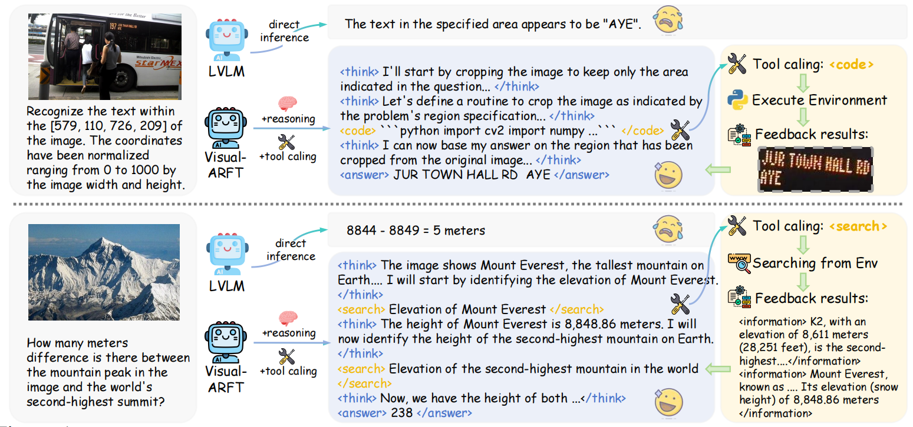
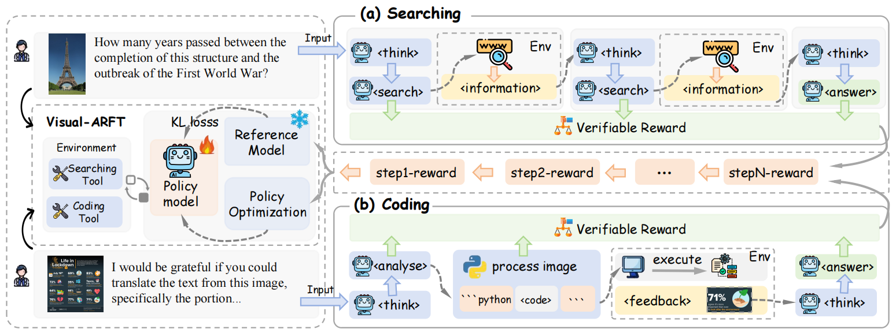

<p align="center">
<!--   <h1 align="center"></h1> -->
  <h1 align="center">Visual Agentic Reinforcement Fine-Tuning</h1>
    <p align="center">
    <a href="https://github.com/Liuziyu77"><strong>Ziyu Liu</strong></a>
    ·
    <a href="https://yuhangzang.github.io/"><strong>Yuhang Zang</strong></a>
    ·
    <a href=""><strong>Yushan Zou</strong></a>
    ·
    <a href="https://github.com/liang-zijian"><strong>Zijian Liang</strong></a>
    ·
    <a href="https://lightdxy.github.io/"><strong>Xiaoyi Dong</strong></a>
    ·
    <a href="https://scholar.google.com/citations?user=sJkqsqkAAAAJ"><strong>Yuhang Cao</strong></a>
    ·
    <a href="https://kennymckormick.github.io/"><strong>Haodong Duan</strong></a>
    ·
     <a href="http://dahua.site/"><strong>Dahua Lin</strong></a>
    ·
     <a href="https://myownskyw7.github.io/"><strong>Jiaqi Wang</strong></a>
  </p>
<!--   <h2 align="center">Accepted By ICLR 2025!</h2> -->
<!-- 🏠<a href="https://liuziyu77.github.io/MIA-DPO/">Homepage</a></h3>| -->
  📖<a href="https://arxiv.org/abs/2505.14246">Paper</a> |
  🤗<a href="https://huggingface.co/datasets/laolao77/MAT">Datasets</a> | 🤗<a href="https://huggingface.co/collections/laolao77/visual-arft-682c601d0e35ac6470adfe9f">Models</a></h3>
<div align="center"></div>
<p align="center">
  <p>
🌈A key trend in Large Reasoning Models (e.g., OpenAI’s o3) is the native agentic ability to use external tools such as web browsers for searching and writing/executing code for image manipulation to think with images. In the open-source research community, while significant progress has been made in language-only agentic abilities such as function calling and tool integration, the development of multi-modal agentic capabilities that involve truly thinking with images, and
their corresponding benchmarks, are still less explored. 
    
🌈This work highlights the effectiveness of Visual Agentic Reinforcement Fine-Tuning (Visual-ARFT) for enabling flexible and adaptive reasoning abilities for Large Vision-Language
Models (LVLMs). With Visual-ARFT, open-source LVLMs gain the ability to browse websites for real-time information updates and write code to manipulate and analyze input images through cropping, rotation, and other image processing techniques. We also present a Multi-modal Agentic Tool Bench (MAT) with two settings (MAT-Search and MAT-Coding) designed to evaluate LVLMs’ agentic search and coding abilities.
  </p>
<!--     <a href="">
       
    </a> -->
<br>

<!--  <a href="">
  
</a>  -->

## 📢 News
- 🚀 [05/20/2025] We release our model, datasets, and MAT benchmark on huggingface 🤗<a href="https://huggingface.co/collections/laolao77/visual-arft-682c601d0e35ac6470adfe9f">Huggingface Collection</a>.
- 🚀 [05/20/2025] We release our training and evaluation code.
- 🚀 [05/20/2025] We release **Viual-ARFT** repository.

## 💡 Highlights
- 🔥 **Visual Agentic Reinforcement Fine-tuning (Visual-RFT)**: We introduce Visual Agentic Reinforcement Fine-tuning (**Visual-ARFT**), which helps Large Language Models to develop agentic ability.
- 🔥 **Multimodal Agentic Tool Bench (MAT)**: We present a Multi-modal Agentic Tool Bench (MAT) with two settings (MAT-Search and MAT-Coding) designed to evaluate LVLMs’ agentic search and coding abilities.
- 🔥 **Strong Multimodal Agentic Capacity**: The model can automatically call a search engine to retrieve information or write and execute Python code to process images. When faced with complex tasks, it can autonomously decompose the problem, plan the steps, and select appropriate tools to complete the task.

<a href="">
  
</a>

## Framework
**Visual-ARFT** adopts RFT strategy, using the GRPO algorithm to update model weights. Based on the task-solving workflow of multimodal agents, we design a rule-based verifiable rewards for both multi-step tool use and final answer generation in LVLMs. With a simple and efficient reward design, the model is encouraged to autonomously explore how to utilize tools and reason through tasks. Our training process relies on only a small number of samples—ranging from a few dozen to at most 1.2k examples—to effectively equip the model with multimodal agentic capabilities. Visual-ARFT conducts RFT on **two challenging task settings**:

**Agentic Search:** When faced with complex multimodal multi-hop questions, the model first analyzes and reasons over visual information, then autonomously decomposes the task, plans retrieval steps, and calls a search engine to gather external knowledge for integrated answering.

**Agentic Coding:** When encountering visually degraded inputs (e.g., blur, rotation, overexposure), the model can actively generate Python code to restore or crop the image, extract relevant regions, and complete visual question answering accordingly.

<a href="">
  
</a>

## 🛠️ Setup
```
git clone https://github.com/Liuziyu77/Visual-RFT.git
conda create -n Visual-ARFT python=3.10
conda activate Visual-ARFT
cd Visual-ARFT
bash setup.sh
```
> 📌 Please note that the required **training environment** setup is the same as that of *Visual-RFT*. If you're already familiar with the *Visual-RFT* environment, you can directly train based on that setup.
> 
> 📌 If you only need to perform **inference** or **evaluation**, any environment that supports running Qwen2.5-VL will be sufficient.

## Inference
We have uploaded the model trained for Agentic Search (<a href="https://huggingface.co/laolao77/Visual-ARFT-Search">🤗Model</a>) and Agentic Coding (<a href="https://huggingface.co/laolao77/Visual-ARFT-Coding">🤗Model</a>). You can use it to try our demos in `demo`. For more details, please refer to `demo/README`.

## Training
### Datasets
To train your own model, first visit <a href="https://huggingface.co/datasets/laolao77/MAT">🤗Datasets</a> to download the datasets. In our Hugging Face **MAT** repository, there are two main folders: **MAT-Benchmark** and **MAT-Training**. The training data is located in the **MAT-Training** directory.

> 🔔 `MAT/MAT-Training/rft_agent_search_20.json` is used for training **Agentic Search** capabilities. It contains a total of 63 training samples derived from 20 original data points.
> 
> 🔔 `MAT/MAT-Training/rft_agent_code_1_2k.json` is used for training **Agentic Coding** capabilities. It contains a total of 3400 training samples derived from 1200 original data points.

### GRPO Scripts
After downloading the dataset, you can start training using the following example bash script. Our bash scripts are in ```/src/scripts```

The following script is an example for training the *Agentic Search* model. Running 200 steps on 8 GPUs takes approximately 2 hours. For more cases, please refer to the ```/src/scripts``` folder.

```
export DEBUG_MODE="true" # Enable Debug if you want to see the rollout of model during RL
export LOG_PATH="./log_qwen25vl_7b_grpo_agent_search_data20_63_gpu8.txt"

torchrun --nproc_per_node="8" \
    --nnodes="1" \
    --node_rank="0" \
    --master_addr="127.0.0.1" \
    --master_port="12345" \
    /src/visual_arft/src/open_r1/grpo_agent_search.py \
    --output_dir /share_models/Qwen2.5-VL-7B-Instruct_GRPO_agent_search_data20_63_gpu8 \
    --model_name_or_path /share_model/Qwen2.5-VL-7B-Instruct \
    --dataset_name /train_data/rft_agent_20.json \
    --deepspeed /src/visual_arft/local_scripts/zero3_offload.json \
    --max_prompt_length 2048 \
    --per_device_train_batch_size 1 \
    --gradient_accumulation_steps 2 \
    --logging_steps 1 \
    --bf16 true \
    --report_to wandb \
    --gradient_checkpointing true \
    --attn_implementation flash_attention_2 \
    --max_pixels 401408 \
    --num_train_epochs 400 \
    --run_name Qwen25-VL-7B-GRPO-Agent-Search-data20-63-gpu8 \
    --save_steps 100 \
    --save_only_model true \
    --num_generations 8
```
### OOM Tips 
⏰ Running into OOM (Out-Of-Memory) issues during training is quite common, especially when using GPUs with limited memory. 

🔦 But no worries — here are some helpful **OOM tips** for you:

1. **About distributed training:** You can alleviate memory pressure by specifying the `--deepspeed` argument, e.g. `--deepspeed /src/visual_arft/local_scripts/zero3.json`.  If memory is still insufficient, you can further reduce the load by using: `--deepspeed /src/visual_arft/local_scripts/zero3_offload.json`.

2. **About the number of generations per group in GRPO:** You can reduce GPU memory usage by lowering the `--num_generation parameter`. In the example script, the default value is `--num_generation 8`, but you can try setting it to 4 to save memory. Keep in mind, though, that a smaller `--num_generation` may lead to worse performance.
  
3. **About gradient_checkpointing:** Moreover, setting `--gradient_checkpointing` to `true` can save memory, allowing for a higher `--num_generations` limit, which leads to better training performance. However, it will slow down the training process.

4. **About Image resolution:** If you're still encountering OOM issues, you can also reduce the resolution of the images in the training dataset!

## Evaluation
To reproduce the experimental results reported in our paper, please use the evaluation scripts provided in the `evaluation_coding` and `evaluatin_search` folder.
> 🔔 We provide a step-by-step tutorial for using the evaluation code in each folder. If you encounter any issues, feel free to open an issue.


## ✒️Citation
If you find our paper and code helpful, we would be truly grateful if you could consider citing our work ✒️ or giving the project a star ⭐️ . 
Your support means a lot to us and encourages our continued efforts in open research.
```
@article{liu2025visual,
  title={Visual-RFT: Visual Reinforcement Fine-Tuning},
  author={Liu, Ziyu and Sun, Zeyi and Zang, Yuhang and Dong, Xiaoyi and Cao, Yuhang and Duan, Haodong and Lin, Dahua and Wang, Jiaqi},
  journal={arXiv preprint arXiv:2503.01785},
  year={2025}
}
```

## 📄 License
  **Usage and License Notices**: The data and code are intended and licensed for research use only.

## Acknowledgement
We sincerely thank projects <a href="https://github.com/Deep-Agent/R1-V">R1-V</a>, <a href="https://github.com/huggingface/open-r1">Open-R1</a>, and <a href="https://github.com/EvolvingLMMs-Lab/open-r1-multimodal">Open-r1-multimodal</a> for providing their open-source resources.


